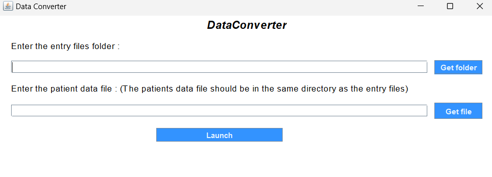
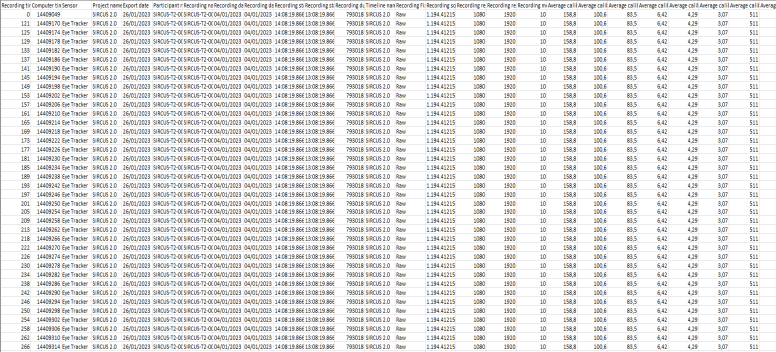
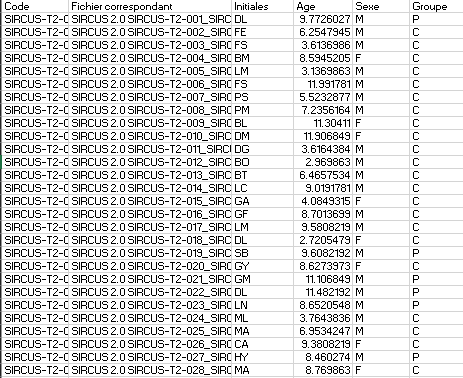
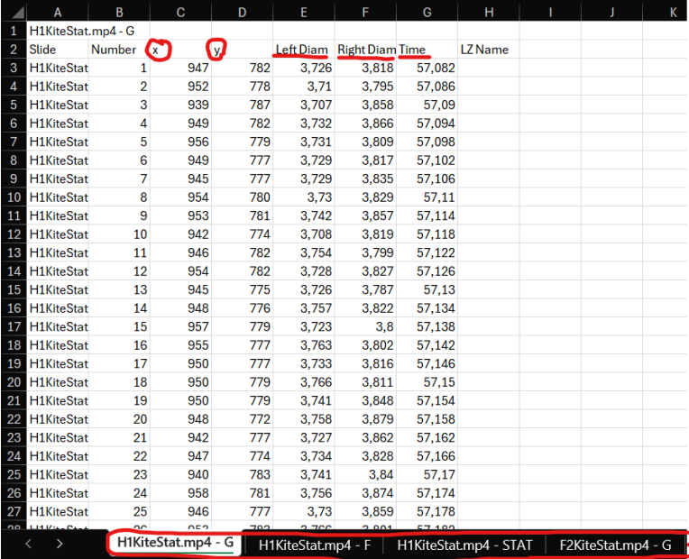

# Data converter
---
## Description

This project is about a data conversion functionality to integrate into the software used for autism detection research.

## Overview

The program consists on of a home page where the user can select a folder and a file to launch the program.

## Entry files

Entry files are Excel files, first we have a directory that contains all the files we want to convert, here's an example 
of what the entry files should look like:

 Then we have another Excel file that should contain the data about patients, here's what the file should look like:

 **NOTE : The patient data file and entry files should all be in the same directory**

## Output files

The output files will be stored inside a **Result** directory, here's what output files will look like: 

## Technologies Used

- ** Java 11 **.
- ** Apache POI ** : library used to manipulate Excel files.
- ** Swing **.

## Contact

For any inquiries or suggestions, please contact [redatarg@gmail.com](mailto:redatarg@gmail.com).